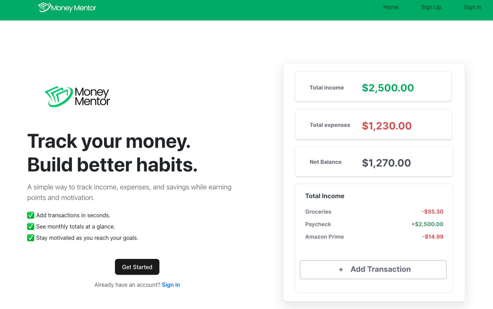
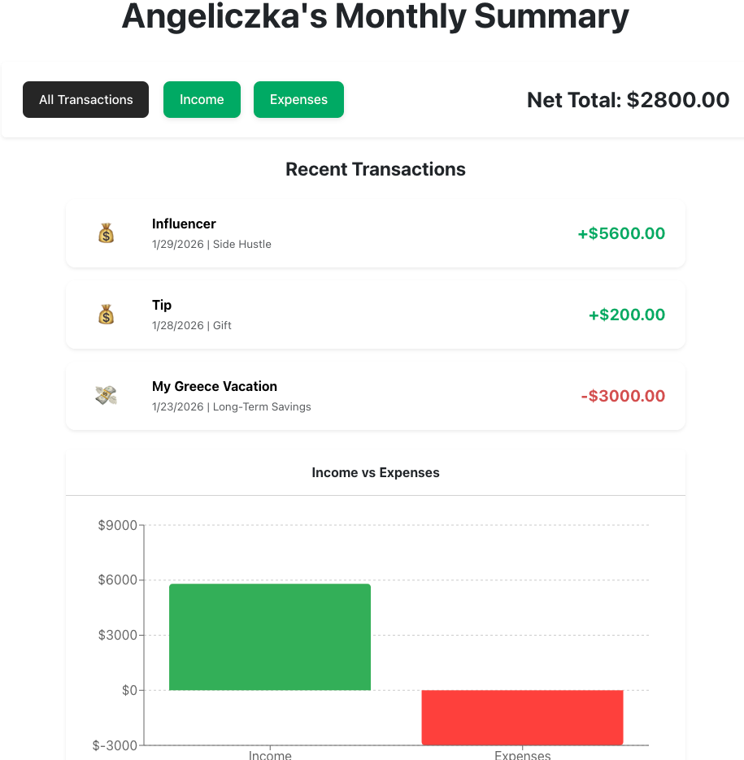
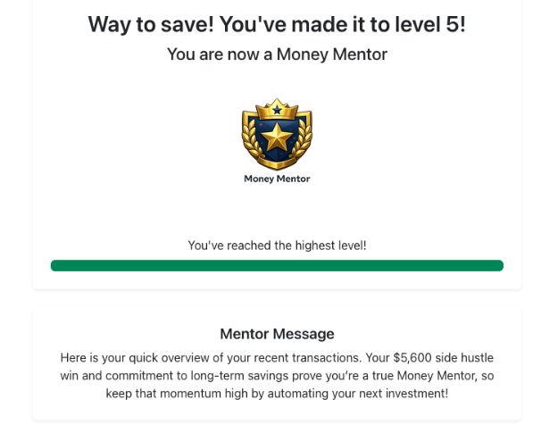

  
---
# Frontend

Money Mentor is a react-based CRUD application for tracking personal finances and building better money habits through visibility and motivation.

Built with React, React Router, and a custom REST API.

---

Money Mentor helps users track income and expenses, view monthly summaries, and stay motivated with a points-based mentor system.

## Tech Stack

- React (Vite)
- React Router
- JavaScript
- CSS
- REST API
- Netlify (deployment)

---

## Getting Started

### Prerequisites
- Node.js (v18+ recommended)
- npm
- Backend API running locally or deployed

### Installation
1. Clone the frontend repository  
2. Install dependencies
 npm i
 npm install jspdf html2canvas

3. Create a `.env` file and add the backend API URL  
VITE_API_URL=your_backend_url_here
4. Start the development server  
npm run dev

The app will run at `http://localhost:5173` by default.

### Backend Repository
The backend REST API for this project can be found here:  
[Backend](https://github.com/angelikakasia/money-mentor-back-end)

Make sure the backend is running before using the frontend.

----

## Features

- User authentication (signup, login, logout)
- Protected routes for authenticated users
- Create, edit, and delete income and expense transactions
- View transactions by month
- Monthly summary with totals and charts
- Mentor system with motivational messages
- Points and level progression based on user activity

---

## Mentor System (Stretch Goal)

- Mentor provides personalized motivational feedback
- Users earn points for positive financial actions
- Levels unlock based on total points
- Users can see points remaining to the next level

---

## Notes

- Frontend built with React and Context API
- Authorization enforced by backend
- Users can only modify their own data

## Development Team

This project was built collaboratively by:
- **Angelika** - | [GitHub](https://github.com/angelikakasia?tab=repositories) | [LinkedIn](https://www.linkedin.com/in/angszy/) |

- **Gabriel Restrepo** - | [GitHub](https://github.com/gabogara) | [LinkedIn](https://www.linkedin.com/in/gabriel-restrepo-acosta/) |

- **Sarah Smith** - |[GitHub](https://github.com/sarahlibx) | [LinkedIn](https://www.linkedin.com/in/sarahsmithdeveloper/) |
